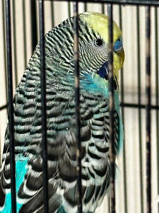
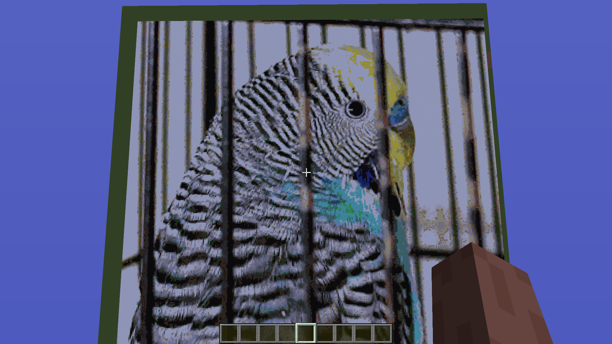

<h1>Image Generator</h1>
<i>Published on: Sunday, 04.20.2025 </i>
<i>Languages: Java </i>
<i>Version: 1.0 </i>

## General Information

This application was coded as a Minecraft plugin for version 1.8. It enables the players to render images from the web in the game. The plugin can only render images horizontally and is designed for the super flat world (grass).

My server has 2 GB of RAM and was able to render most of the provided images, including large ones. However, please be cautious and increase the image size gradually to see how well your server handles rendering larger images.

## How to use the plugin

There are two essential commands inside the plugin:

<ol>
<li><b>/generateimage [URL]</b> → Takes the image from the given URL and draws the image in game.</li>
 
<li><b>/clearimage</b> → Clears the drawn image.</li>
</ol>

Let's test the image-generation command. We take this cute image of my little budgie:

You can replicate it, too, to test the image generation. The complete command is "/generateimage https://kleinworkspace.com//images/Image_Generator/myBudgie.png".

          
When you press enter, the plugin will download the image first and tell you the width and height in pixels. When the download is successful, the image is drawn. In every world, the beginning of the drawing (top left) has the coordinates x=0, y=4, z=0. The resulting image should look like this:

The program goes through each pixel and determines with the weighted Euclidean distance the best possible block, that represents the same color as the pixel.

<a href="https://www.baeldung.com/cs/compute-similarity-of-colours">Source: Baeldung</a>
